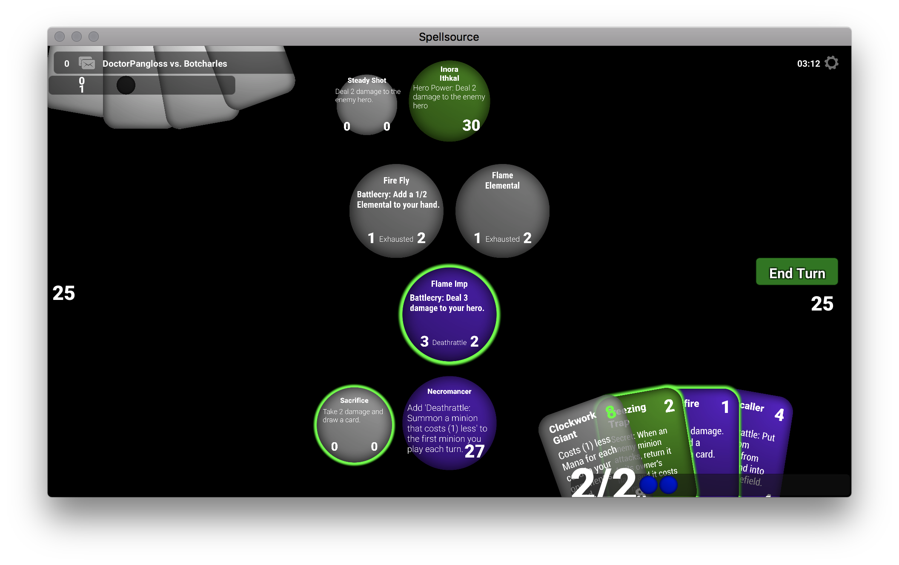

# Spellsource-Server

[](https://travis-ci.org/hiddenswitch/Spellsource-Server)



A multiplayer, networked adaptation of `metastone`

Download the Hidden Switch Launcher for [Mac OS X](http://go.hiddenswitch.com/mac) or [Windows](http://go.hiddenswitch.com/win) to get a copy of the game client. Play online against others! No other installation required.

Please see the issues tab to report bugs or request functionality.

### Description

`metastone` was a simulator for the online collectible card game (CCG) Hearthstone&reg; by Activison Blizzard written in Java. It strives to be a useful tool for card value analysis, deck building and performance evaluation. There is also support for custom cards, allowing users to implement their own card inventions and testing them within the simulator engine. `metastone` tries to re-implement all game mechanics and rules from the original game as accurately as possible. 

The `Spellsource-Server` project adapts and updates `metastone` to fully support hosted, networked gameplay. It features rudimentary matchmaking, collection management and support for game mechanics that persist between matches. It currently covers 100% of Hearthstone cards, with a handful of bugs, up to Knights of the Frozen Throne.

The `Spellsource-Client` project is not yet released, but it backs the game client for this server. It is fully animated.

The project also contains adapters for Amazon Elastic MapReduce for processor-intensive AI training. Please reach out to the developers in an issue if you'd like to learn more or to use part of our AWS budget for AI experimentation.

### Quick Start Multiplayer

 1. Download the Hidden Switch Launcher for [Mac OS X](http://go.hiddenswitch.com/mac) or [Windows](http://go.hiddenswitch.com/win).
 2. Download the Spellsource Client from within the launcher and start it.
 3. Enter Quick Play to play against a bot, or Matchmaking to play against a random opponent.

### Quick Start Contributing Cards

If you'd like to **contributed or edit cards**, **write new game mechanics** or **improve the server**, follow these instructions to install and run the server:

 1. Install the Java 8 SDK (JDK).
 2. Optionally, install exactly `swagger-codegen` version 2.2.2.
 3. Clone this repository.
 4. To run the server locally, execute the following on a command prompt:
    * Linux/Mac OS X: Run `./gradlew net:local`.
    * Windows: Run `gradlew.bat net:local`.
 5. Download the Hidden Switch Launcher for [Mac OS X](http://go.hiddenswitch.com/mac) or [Windows](http://go.hiddenswitch.com/win).
 6. Download the Spellsource Client from within the launcher and start it.
 7. Your game client will automatically detect your local server and connect to it, as long as the server  is running before you start the client.

### Contributing Cards

Contributing cards consists of writing specially-crafted JSON files into the `cards` directories and writing tests for them.

Additionally, to make it easier to contribute Hearthstone card functionality, the project has an automated test that accepts a URL to a community-standardized `cards.json` and checks which cards are missing. To use this feature, set the environment variable `SPELLSOURCE_CARDS_URL` to `https://api.hearthstonejson.com/v1/latest/enUS/cards.json`, or modify [CatalogueTests](game/src/test/java/com/blizzard/hearthstone/CatalogueTests.java) `getCurrentCards()` method to retrieve the latest URL.

Let's run through a complete example of implementing a card, "Exampler" that reads: `Neutral (1) 4/4. Battlecry: Summon a 5/5 Skeleton for your opponent.`

 1. In GitHub, **fork** the Spellsource-Server repository. Clone your fork. You'll save your new card to this fork.
 2. Create a file, [minion_exampler.json](cards/src/main/resources/cards/custom/minion_exampler.json), in the directory `cards/src/main/resources/cards/custom`. If the `custom` folder does not exist, create it; or, create a folder named after the game or mode for which you are creating cards.
 3. Find a similar card to start as a base. In this case, we'll search for cards that summon other cards. Let's use [Rattling Rascal](cards/src/main/resources/cards/hearthstone/knights_of_the_frozen_throne/neutral/minion_rattling_rascal.json). Copy the contents of that card into `minion_exampler.json`.
 4. Edit the appropriate fields to create this card. My version is below:
 
     ```json
     {
       "name": "Exampler",
       "baseManaCost": 1,
       "type": "MINION",
       "heroClass": "ANY",
       "baseAttack": 4,
       "baseHp": 4,
       "rarity": "EPIC",
       "description": "Battlecry: Summon a 5/5 Skeleton for your opponent",
       "battlecry": {
         "targetSelection": "NONE",
         "spell": {
           "class": "SummonSpell",
           "card": "token_skeletal_enforcer",
           "targetPlayer": "OPPONENT"
         }
       },
       "attributes": {
         "BATTLECRY": true
       },
       "collectible": true,
       "set": "CUSTOM",
       "fileFormatVersion": 1
     }
     ```
     
     A more detailed documentation of what all these fields mean is forthcoming. You're strongly encouraged to look at existing cards to see how various fields, like `battlecry`, `trigger`, and `attributes` work. The various enumerations can be found in the code, but most surprisingly hero classes have been renamed to colors.

 5. Write a test that verifies that the card works. We'll create a new file, [ExampleCardTests](game/src/test/java/com/hiddenswitch/spellsource/ExampleCardTests.java), that uses a "gym" to test that the card does what it is supposed to do. Here's an example test for Exampler:
 
    ```java
    package com.hiddenswitch.spellsource;
    
    import net.demilich.metastone.tests.util.TestBase;
    import org.testng.Assert;
    import org.testng.annotations.Test;
    
    public class ExampleCardTests extends TestBase {
        @Test
    	public void testExampler() {
    		runGym((context, player, opponent) -> {
    			playCard(context, player, "minion_exampler");
    			Assert.assertEquals(opponent.getMinions().get(0).getSourceCard().getCardId(),
    					"token_skeletal_enforcer",
    					"The opponent should have a Skeletal Enforcer after Exampler is summoned");
    		});
    	}
    }
    ```
    
    These tests can be as involved as you'd like, and should explore corner cases or interactions whenever possible. Many simple cards do not require tests. But when you start writing your own code to implement cards, tests are especially important to verify functionality. **All** community-contributed cards that get distributed to the production Spellsource server must have tests.
    
    Visit other tests to see how more complex cards are tested. An example of modifying random outcomes can be found in [`TheOldGodsTests#testYoggSaronHopesEnd`](/game/src/test/java/com/blizzard/hearthstone/TheOldGodsTests.java). For an example of overriding a discover action, see [`JourneyToUngoroTests#testFreeFromAmber()`](game/src/test/java/com/blizzard/hearthstone/JourneyToUngoroTests.java).
    
 6. Run your tests by executing `./gradlew game:test` on Mac or `gradlew.bat game:test` on Windows from a command line. You should receive no errors. If the engine has an issue parsing your card, you'll see an error in `CardValidationTests` with your card name specified.
 
 7. To play with the card, start the server and client using the instructions in the Quick Start guide.
 
 8. Inside the client, choose Quick Play and create a new deck. The format for the deck list uses a standardized community pattern. Here's my example deck list:
 
     ```text
     ### Test Deck Name
     Hero Class: Warrior
     15x Exampler
     15x Innervate
     ```
     
    Select this deck when starting your game. Note the three hashes to indicate the start of a deck name; otherwise, the formatting given here is the minimal amount of content needed to make a valid deck.
    
    You can support more diverse scenarios/Tavern Brawls by specifying a Hero Card by name. For example, create a custom hero named `Enchantress` and add the line `Hero Card: Enchantress` to your decklist.
 9. You will now play against an AI using the card. To play against others on your local network, enter Matchmaking instead of Quick Play. As long as your opponent's client is running on the local network and the network supports UDP broadcasting (most local Wi-Fi networks), your opponent's client will discover your local server. In the Spellsource client, a toast will appear at the bottom of your login screen indicating that you have connected to a local server if it successfully found one.
 10. Once you are satisfied with your card, format it correctly by executing [`formatter.py`](cards/formatter.py) from the `cards` directory in a command line. You must have `python` on your path to execute the formatter.
 11. To contribute the card to the public networking servers, commit your changes to your fork with `git commit -am "A custom note about the card"`, `git push` and then pull-request to this repository.