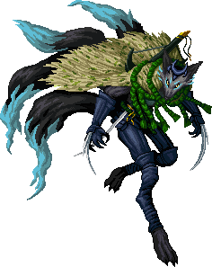

Faloran is a
[Hengeyokai](/wiki/Hengeyokai "wikilink") [Kitsune](Kitsune "wikilink") (Fox)
Ninja and leader of the Kitsune subclan.

### Biography

Among his Kitsune family, Faloran was always considered the runt of the
litter. Used to being bullied and forced to be a loner, Faloran had to
rely on his intelligence to get by. This made him his parents' favorite
and fostered resentment among his siblings.

At around age 2, he was left alone in the forest by his conniving
siblings as revenge. The joke turned into a nightmare when his family
couldn't find him. But Faloran learned how to survive on his own,
growing in strength, invisibility, and stealth. He also became a master
thief and an expert killer, rising through the ranks as a Dragovian
mercenary.

He never returned to his family and took the name Faloran—which
literally means "fox" in ancient Norse. No one knows his real name. When
the [humans](humans "wikilink") land and the
[Dragovian](/wiki/Dragovian "wikilink") clans abandon [Princess
Briila](/wiki/Princess_Briila "wikilink"), she will call on Faloran, her best
mercenary, to fight beside her. And he will fight as long as she can
pay.
