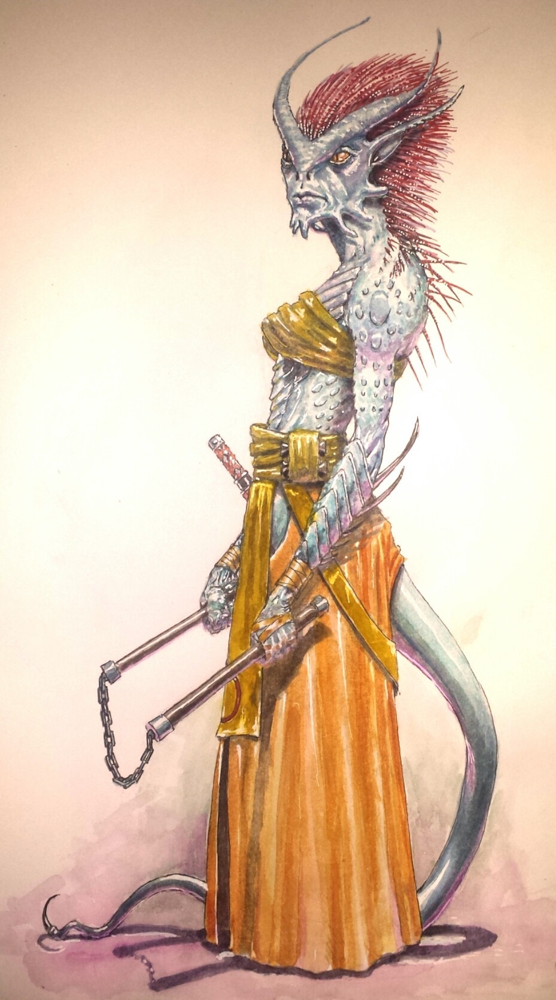

The Bogovey are a clan of [Dragonvians](/wiki/Dragovians "wikilink"), the dominant dragon-race of the Lun Islands. Dragovians are like Elves in traditional fantasy -- they are brilliant architects and fighters, but also arrogant and conservative. Bogovey are the outcasts of Dragovian society. They are rebellious, independent, and ruthless. And because of a crime committed far in the past, they cannot fly and are cursed to live underground. Think of them as Dark Elves.

Hundreds of years ago, the great Dragovian scholar [Bogovar](/wiki/Bogovar "wikilink") dared to question Dragovian religion. All Dragovians believe that the world was created by their geometrically shaped serpent-like ancestors who fought a war with the demons and sealed them underground. They also believe that magic is the promethean gift bestowed them by the same Gods and there's no more to harness. But Bogovar didn't buy it. He was an alchemist, and according to his research, magical power comes from somewhere underground. It is a substance… not a gift from the Gods. So in order to harness it, he traveled to the Demongate on Krah island to get safe passage underground. By working with the Demons(/wiki/Oni "wikilink") -- or Oni -- of the island, Bogovar broke the greatest taboo of Dragovian society. He was sentenced to death for his sins, which ignited a brutal civil war between the Dragovian establishment and his followers who called themselves Bogovey. They used his theory of magic to summon demons and powerful spells for war. But they were too few in numbers to triumph. Ultimately all the Dragovian clans united against them and they were cursed to live underground.

In the hundreds of years hence, life in caves under Mount Moromah made the Bogovey lose their wings. But they never lost their fascination with magic. And they've been biding their time for revenge ever since.