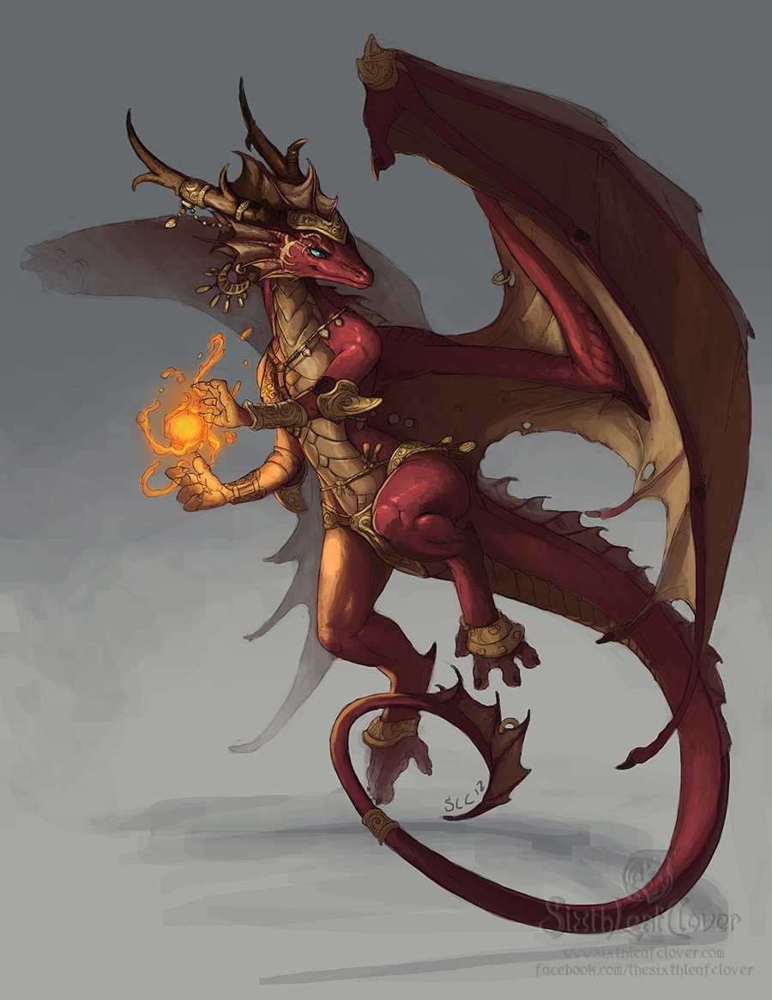
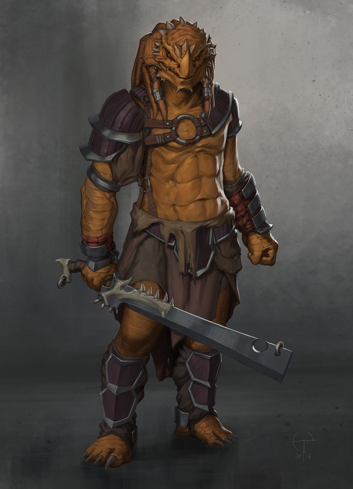
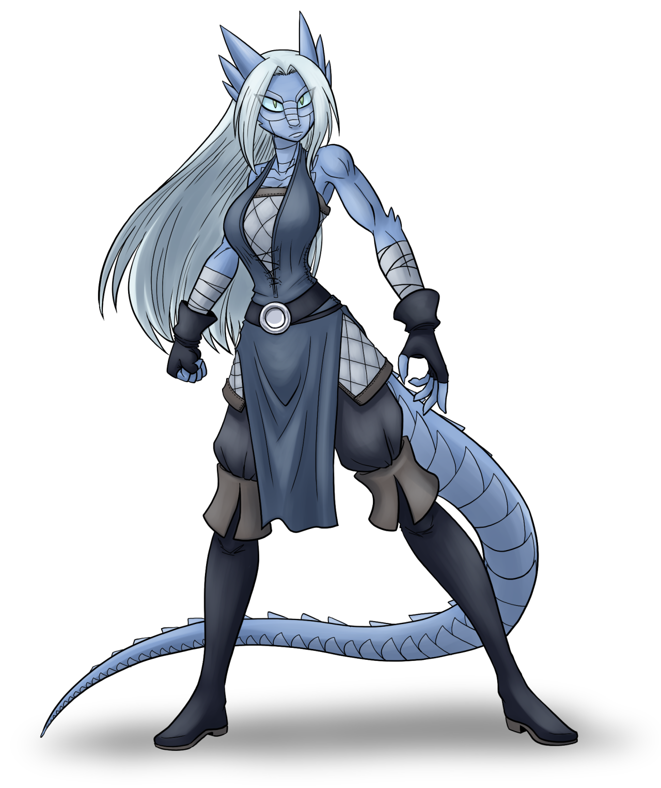

  

 Dragovians are the dominant race
of the [Lung Islands](/wiki/Moromah_Island "wikilink"). Appearing more
humanoid than traditional dragons, they are superior spell-casters and
have a strong warrior culture that is nonetheless disappearing. Think of
them as a cross between Elves and Samurai.

### Society

Dragovians speak an ancient, loquacious language known as
[Dragovian](/wiki/Dragovian_(language) "wikilink"). They have a feudal system
under an [Emperor](/wiki/The_Emperor "wikilink"), a giant Dragon slumbering
inside [Mount Moromah](/wiki/Mount_Moromah "wikilink"). Since the emperor has
been dormant for thousands of years, real power resides in the
matriarchal family clans. Beneath them, Warlords and warrior monks
pledge fealty and jockey for power. The most powerful clan is the
[Vohlok](/wiki/Vohlok "wikilink"), led by [Princess
Briila](/wiki/Princess_Briila "wikilink"). Her manipulation of other clans has
minimized conflict and kept her family in power, but the peace is
fragile.

Each of the four major clans—[Vohlok](/wiki/Vohlok "wikilink"),
[Fassnu](/wiki/Fassnu "wikilink"), [Jerbrod](Jerbrod "wikilink"), and
[Bogovey](/wiki/Bogovey "wikilink")—have different characteristics.

-   The **Vohlok**, known for their learned warrior monks, have their
    seat at the foot of Mount Moromah. Their traditional roles as the
    guardians of the emperor and their proximity to the source of magic
    make them powerful spell casters.
-   The **Fassnu** are ruthless samurai with limited flying. They are
    stouter in appearance with massive jaws like upright crocodiles.
-   Living on the [Eastern Cliffs](/wiki/Eastern_Cliffs "wikilink"), the
    **Jerbord** are supreme fishers, fliers, and traders. They are the
    most social dragovians and resemble pterodactyls.
-   Finally, the **Bogovey** are heretics from the Vohlok Clan whose
    wings have been cut off. They live underground.

Obligate carnivores, Dragovians fish and hunt for food, which keeps
their population small or dwindling. Their cities are great stone aeries
built on the top of mountains or coastal cliff faces by their ancestors.
The giant architecture filled with lost symbols suggest that their
ancestors were all huge dragons like the emperor. Theirs is a society on
a slow decline.

### Belief System

The Dragovians worship a pantheon of dinosaur-like dragons and believe
their [giant sleeping emperor](/wiki/The_Emperor "wikilink") is one of the
Gods' direct descendants. These Gods fought great demons in order to
create the world and sealed these evil spirits underground. Some Gods
include; the giant flying [Ketzal](/wiki/Ketzal "wikilink") (looks like a
Quetzalcoatlus), patron of the Jerbord, and [Ankylo](/wiki/Ankylo "wikilink")
(think flying Ankylosaurus), patron of the Fassnu. After defeating the
demons, the Gods built great cities throughout the Islands that the
Dragovians inhabit now. Then they mysteriously disappeared. Their magic
is alchemical secrets passed from the Gods down to the Dragovians.

The heretical Bogovey do not believe their ancestors were Gods. Rather,
they think that the demons—or spirits of the Islands—are the real
manifestation of power and worship them. Their scholars think Magic is a
force deposited on the Island through Mount Moromah's eruptions. There
exists a pure world of magic, the world of the [Oni](/wiki/Oni "wikilink"),
underneath their world.
