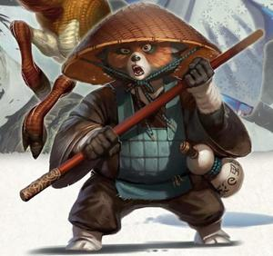
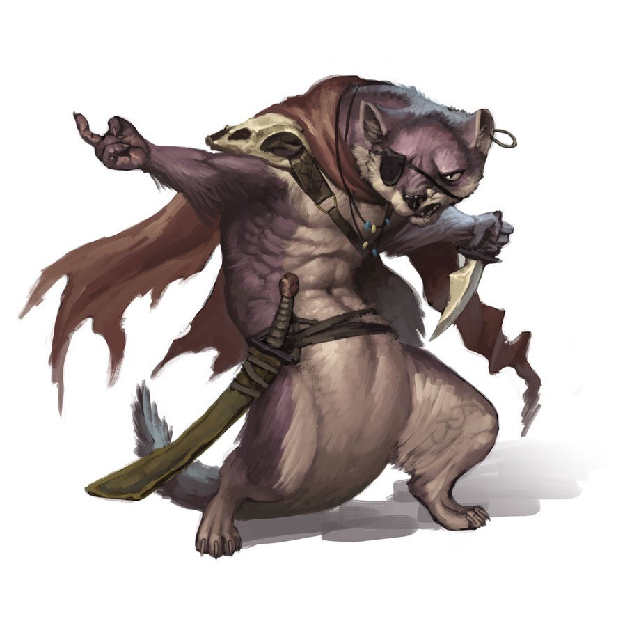
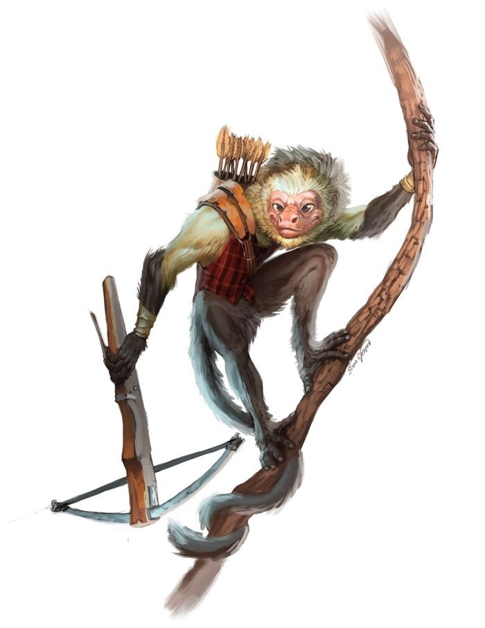
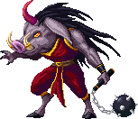
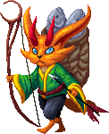

 

The Hengeyokai are shape-shifting animals who can take either an animal or
hybrid form. In their animal form, they are indistinguishable from
regular animals. In their hybrid form, they appear as humanoids with the
face of an animal. The first Hengeyokai were animals that gained power
due to exposure to the Islands' magic.

### Language and Names

The Hengeyokai have their own language (a form of
[Wyspan](/wiki/Wyspan "wikilink")), which is the same regardless of animal
type, and which they speak regardless of their form. They can also
communicate with natural animals with the same form or closely related
form as theirs. For instance, an Inu (dog) can understand dog and wolf
language. They can also converse with Humans and Dragovians, as they
adapt quickly to their surroundings and are semi-magical beings. They
are usually named after their physical appearance or character traits.

 

### Society and Customs

They are found throughout the Islands, usually on the fringes of
dragovian civilization. Only the Tanuki form communities of their own,
the others preferring loosely organized bands. They like to avoid
prolonged contact with other races, unless they become the protectors of
families. This is most common with the Inu (dog) and the Bakeneko (cat).
In return for protection from outsiders, they receive food and sometimes
shelter. Otherwise, Dragovians and other races usually avoid the
Hengeyokai, particularly the Kitsune (foxes) and Mujina (badgers). The
Hengeyokai tend to eat foods associated with their animal forms. For
instance, a cat hengeyokai will be a strict carnivore, while a sparrow
hengeyokai will only eat seeds and grain.

 

### Sub-Races and Personality

There are thirteen sub-races of Hengeyokai:

-   The [Tanuki](/wiki/Tanuki "wikilink") (raccoon dogs) are the main and
    biggest sub-race of Hengeyokai. They live in clans in the forest and
    elect a leader called the "Great Tanuki" to oversee land and
    organize its members. The most famous of them, who was in place when
    the Humans came to the Islands, is known as [Ren](/wiki/Ren "wikilink"),
    short for "Reneldae Brinelda Arthren" (Sylvan for Red Bear). Tanuki
    dwellings consists of crude but sturdy shelters made of wood and
    stone, similar to those of Hobbits. They share their land with the
    [Saru](/wiki/Saru "wikilink") (monkeys), who live in the trees in small
    families. They also let what they call the "inferior" races—the
    [Nezumi](/wiki/Nezumi "wikilink") (rats), [Usagi](Usagi "wikilink")
    (hares), [Inu](/wiki/Inu "wikilink") (dogs) and
    [Inoshishi](/wiki/Inoshishi "wikilink") (boars) live on their land.
-   The [Kitsune](/wiki/Kitsune "wikilink") (foxes) are the second biggest
    sub-race of Hengeyokai. They live in family dens and only interact
    with Dragovians or Humans to trade or cheat them of food or
    valuables. They are usually more intelligent than their fellow
    Hengeyokai.
-   The [Suzume](/wiki/Suzume "wikilink") (sparrows) have the least amount of
    contact with [Dragovians](/wiki/Dragovians "wikilink") and other
    Hengeyokai, preferring to keep to themselves in their mountain
    homes.
-   The [Bakeneko](/wiki/Bakeneko "wikilink") (cats) lead their lives
    relatively independently from other cats or Hengeyokai. They
    sometimes like to dwell in Dragovian families. They're great
    hunters.
-   The [Mujina](/wiki/Mujina "wikilink") (badgers)are territorial loners and
    fighters that are more likely to attack another one of their race on
    sight for trespassing.
-   The [Koi](/wiki/Koi "wikilink") (carps), [Kawauso](Kawauso "wikilink")
    (otters) and [Kaeru](/wiki/Kaeru "wikilink") (frogs) all share a common
    habitat in the rivers. They live in small families or bands and
    don't interact much with other Hengeyokai. They are the most
    pacifist of the sub-races.
