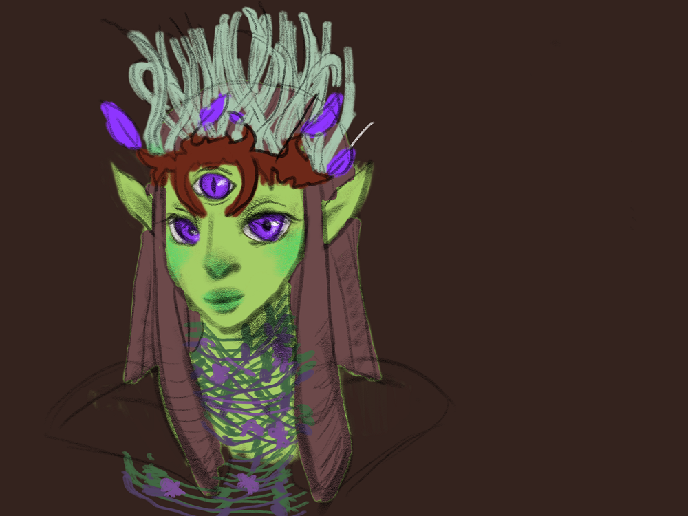

 Inora Ithkal is a
Healer of the [Fae](/wiki/Fae "wikilink") of the Land.

### Biography

Raised deep in the jungle of [Yokai](/wiki/Yokai "wikilink"), Inora learned
magic from a young age from [her aunt](her_aunt "wikilink"), the clan's
witch. Like other [Fae](/wiki/Fae "wikilink") in her tribe, she devoted
herself to the Lord of the Forest, [Shiramba](/wiki/Shiramba "wikilink"). Yet,
she always felt a little different. When Hengeyokai merchants would come
by, she'd sneak out and observe them. When
[Dragovians](/wiki/Dragovians "wikilink") would send out their warriors to
explore the forest, she'd try and learn their language and manners. Her
aunt warned her: if Shiramba finds out about her fascination with other
races, she will be exiled. But she didn't listen.

When the Humans invaded the Islands, she immediately fell in love with
[Shun He](/wiki/Shun_He "wikilink"), the blind explorer. She begged the Lord
to become their allies. If the war with the Dragovians reached them,
they would need the human's help. Shiramba agreed, but if the Humans did
anything wrong, the folk destroy their colony. And if he ever discovered
her relationship, Inora thought, she would face even more dire
consequences.
