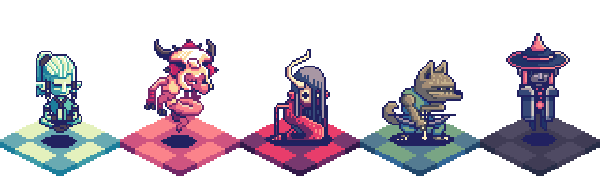

### Your journey begins here...

Greetings, [settler](/wiki/Humans "wikilink")! The world's greatest explorer,
[Shun He](/wiki/Shun_He "wikilink"), leads an expedition to find the fabled
source of all magic. After many months at sea, his ships pierce a
[magical barrier](/wiki/Lunopause "wikilink") and crash on a mysterious
[Volcanic island](/wiki/Moromah_Island "wikilink"). With his ships destroyed,
he steps up a colony aided by local [Fae](/wiki/Fae "wikilink"), strange
humanoid creatures imbued with magic. This must be the spell-source
they've been seeking. But unbeknownst to the colonists, the
[Dragons](/wiki/Dragovians "wikilink") are watching and preparing to drive
them off the island.

The war between people and Dragovians will force all the other island
races—[Fae](/wiki/Fae "wikilink"), the plucky
[Hengeyokai](/wiki/Hengeyokai "wikilink"), and the dark
[Oni](/wiki/Oni "wikilink")—to pick up arms. Which side will you choose?

### Setting

    
Where Spellsource takes place.

Spellsource takes place on the islands of the [Lung
Archipelago](/wiki/Moromah_Island "wikilink") in a medieval fantasy setting.
Outside the archipelago lies the [The Mainland](/wiki/The_Mainland "wikilink")
(also known as the Old World or just the [Lotus
Empire](/wiki/Lotus_Empire "wikilink"), its principle civilization).

Important locations include [Pearl Colony](/wiki/Pearl_Colony "wikilink"), the
principle settlement of the humans, and [Moromah
Island](/wiki/Moromah_Island "wikilink"), the largest island of the
archipelago. [Mount Moromah](/wiki/Mount_Moromah "wikilink") is the geographic
location of the largest city on the island,
[Atumjun](/wiki/Atumjun "wikilink"). Its most unusual gateway is the
[Demongate](/wiki/Demongate "wikilink"). Another large city is [Gramlot](/wiki/Gramlot "wikilink").

### Conflict

The power struggle that started it all.

A power struggle began among the [Dragovians](/wiki/Dragovians "wikilink"),
the dominant race on the islands. Their
[Emperor](/wiki/The_Emperor "wikilink") has fallen into a deep sleep of
magical origins, and the various tribes of the Dragovians suspect each
other of betraying the throne. Meanwhile, [humans](humans "wikilink")
have made [First Contact](/wiki/First_Contact "wikilink") with their arrival
to the islands, as foretold by the [Vision of
Landfall](/wiki/Vision_of_Landfall "wikilink").

### Heroes

Who will you main?

-   [Shun He](/wiki/Shun_He "wikilink"), the Grand Alchemist of the Lotus
    Empire.
-   [Princess Briila](/wiki/Princess_Briila "wikilink"), the Former High
    Priestess.
-   [Faloran](/wiki/Faloran "wikilink"), the Ninja.
-   [Inora Ithkal](/wiki/Inora_Ithkal "wikilink"), the Healer.
-   [Paucha](/wiki/Paucha "wikilink"), the Goddess of Madness.

### Inhabitants

Who will you meet?

-   [Dragovians](/wiki/Dragovians "wikilink"): Dominant race of the islands,
    their gargantuan ancestors (think dragon meets dinosaur) built
    temples and cities before mysteriously disappearing.
-   [Humans](/wiki/Humans "wikilink"): The dominant race in the outside world,
    they are led by an eccentric and ruthless explorer to the Lung
    islands in hope of finding the source of all magic.
-   [Hengeyokai](/wiki/Hengeyokai "wikilink"): Intelligent shapeshifting
    animals. They can shapeshift from a full animal form to a bipedal
    humanoid animal form at will. They can also speak to animals.
-   [Oni](/wiki/Oni "wikilink"): An ogre-like race of demons. They were meant
    to guard the threshold between the material world and the spirit,
    but then some escaped to our world and settled.
-   [Fae](/wiki/Fae "wikilink"): Earlier human "settlers" of the islands, they
    are imbued with natural magic and come in blue (sea) and green
    (land) varieties. They are nomadic and live in small tribes.
    

### How To Play

Click for instructions.

(A more detailed description can be found [here](/wiki/How_to_Play).)

Players combat each other using cards in a one-versus-one matchup until one of the player's champions is destroyed.

Each player starts the match by choosing which cards to discard from their initial hand (the Mulligan). Then, one of the two players takes his first turn, while the other receives a bonus Mana card called the coin.

At the start of each turn, players gain 1 mana, up to 10. This mana is spent playing cards.

Some cards can put minions on the board. Minions have an attack value (the lower left number) and a health (the lower right number). At the start of the next turn, minions can attack opposing minions or the opposing hero, dealing and taking damage. Minions whose health goes below zero are destroyed.

Some minions and spells accept targets when they are played. For a minion, this is typically part of an "Opener," or action played from the hand.

Text comes "into play" as soon as both players see it. This is typically on the battlefield, or the two rows (yours and your opponent's) of minions, the champions, the weapons they have equipped, and the Skill.

The weapon is a bonus item that grants your champion the ability to attack.

The Skill is a spell that is playable once per turn specific to your champion.

### Credits

See the [credits](/credits "wikilink") page.
