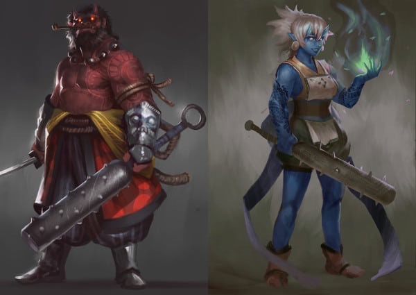

 A long
time ago, the [Vohlok](/wiki/Vohlok "wikilink")
[Dragovians](/wiki/Dragovians "wikilink") fought a religious war against a
heretical sect. The heretics summoned the demonic Oni as soldiers and
devastated the islands. The Vohlok won and drove the Oni back and sealed
their [Demongate](/wiki/Fire_Gate "wikilink"). The Volhok also used their
magic to make the heretics flightless. The heretics became the
[Bogovey](/wiki/Bogovey "wikilink").

### Society

Some lesser Oni remained and settled on the cold barren island Krah near
the sealed Demongate. Their time on the island has made them more
civilized, and they live in warbands constantly fighting against each
other or as mercenaries for the occasional Dragovian warlord. These
lesser Oni resemble demon like ogres, orcs, and trolls. They are blue
and red.

However, Greater and more chaotic Oni can be summoned by any magic user
on the islands. Some have exchanged their services for freedom and now
roam a swamp or haunt a ruined castle. The Bogovey still regularly call
upon these creatures.
