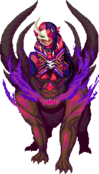

## Paucha

 Paucha is the Goddess of Madness of
the Oni.

### Biography

Surely it was an act of madness for [Agfen](/wiki/Agfen "wikilink") to open
the demongate in the northeast corner of Moromah Island. And just as
surely it was Paucha, the Goddess of Madness, who answered his call. The
other Gods allowed Paucha to go because they believed this war could
finally drive the Dragovians—and all the other races—off the island and
return it to its natural state.

When Agfen was discovered and defeated by his own
[father](/wiki/Lir "wikilink"), the Gods recalled Paucha home. But she refused
to go. She found war much madder than anything she had ever experienced
and promised herself to sow it everywhere. She offered to drive Agfen's
father insane in exchange for her freedom. He agreed. Now in a fortified
settlement on [Krah](/wiki/Krah "wikilink"), she bides her time with her
warband of Oni. When the Vohlok march off to war against the humans,
Paucha will see her chance to strike. She will push
[Agfen](/wiki/Agfen "wikilink") and the Bogovey to fight the Dragovian clans
again.
