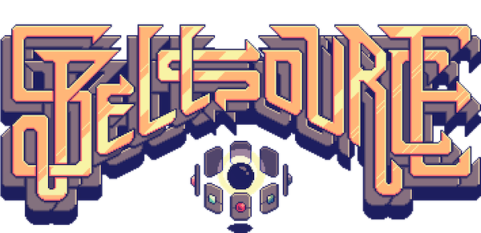

 - **[Play Now](game)**
 - **[Discord](https://discord.gg/HmbESh2)**
 - **[Contribute](contribute)**

Spellsource is a community-driven digital card game **where every card is free**. Spellsource features thousands of community-authored cards.

Support us by [authoring your own cards](/contribute) and [contact us](mailto:ben@hiddenswitch.com) about your own art.

This is alpha-quality software. You can learn more on our [GitHub](https://github.com/hiddenswitch/Spellsource-Server).
 

#### The Heroes

The world's greatest explorer, Shun He, leads an expedition to find the fabled source of all magic. After many months at sea, his ships pierce a magical barrier and crash on a mysterious Volcanic island. With his ships destroyed, he steps up a colony aided by local Fae, strange humanoid creatures imbued with magic. This must be the spell-source they've been seeking. But unbeknownst to the colonists, the Dragovians are watching and preparing to drive them off the island.

#### The War

The war between people and Dragovians will force all the other island races—Fae, the plucky Hengeyokai, and the dark Oni—to pick up arms. Which side will you choose?

#### How To Play

Players combat each other using cards in a one-versus-one matchup until one of the player's champions is destroyed.

Each player starts the match by choosing which cards to discard from their initial hand (the Mulligan). Then, one of the two players takes his first turn, while the other receives a bonus Mana card called the coin.

At the start of each turn, players gain 1 mana, up to 10. This mana is spent playing cards.

Some cards can put minions on the board. Minions have an attack value (the lower left number) and a health (the lower right number). At the start of the next turn, minions can attack opposing minions or the opposing hero, dealing and taking damage. Minions whose health goes below zero are destroyed.

Some minions and spells accept targets when they are played. For a minion, this is typically part of an "Opener," or action played from the hand.

Text comes "into play" as soon as both players see it. This is typically on the battlefield, or the two rows (yours and your opponent's) of minions, the champions, the weapons they have equipped, and the Skill.

The weapon is a bonus item that grants your champion the ability to attack.

The Skill is a spell that is playable once per turn specific to your champion.

[Learn more about the keywords](keywords)