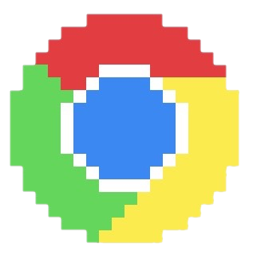

## Play Now

    
    
    
    

For users on other browsers, go to our [Discord](https://discord.gg/HmbESh2) and ask for the Steam key.

##Mobile Betas

#### iOS Users

You can find the iOS Beta [here](https://testflight.apple.com/join/pkMfO2qa). You will be prompted to join our TestFlight group, which is Apple's testing service. You will remain anonymous when you join Testflight this way.

#### Android Users

Join the [Spellsource Google Group](https://groups.google.com/forum/#!forum/spellsource-alpha-testers), then follow the instructions in the welcome message to participate in testing.
You must be logged into Google Play to join the testing program. Your e-mail will be shared with the developers. 

    

